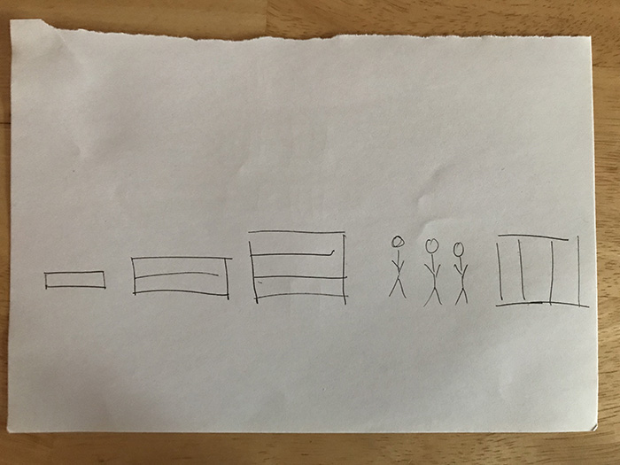
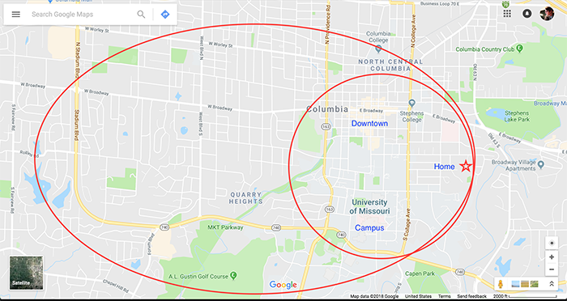

One of the key ideas I want my map to communicate is that I learn incrementally. To break a process into pieces and learn one piece at a time, and then gradually combine those pieces together into something complex. For example, when learning to program, I started by learning how to create a variable, then learning how to create for loops, etc. And then combining those pieces into an application that does something (whether practical or creative).

This concept first became clear to me several years ago when I was in grad school (for the first time) in Columbia, Missouri. My roommate and I lived about a half mile from campus and a half mile from downtown. Biking was the easiest way to get around, and our lives were primarily lived within a radius that include campus (where we went to school), downtown (where we hung out), and home. One time my roommate had some minor medical thing and had to take steroids for a week to get better. I remember at one point during that week he said that he had biked all the way out to opposite end of town that day to burn off some steam. I thought it was strange to bike such a long distance, but realized the steroids had given him extra energy that suddenly made biking to the other end of town something within the realm of possibility. It's not that he wasn't previously unable to bike across town, or that it was unusual to be biking in the first place, but that his conception of his "radius of daily life" was incrementally expanded by the steroids he was taking to become slightly larger.

An important part of the learning process for me is to seek feedback from others. This is something I often forget to do, and it can sometimes be to get unstuck when I don't know something. It can even be hard to know that I'm stuck in the first place! Asking for feedback helps to discover things I wasn't aware of, discuss ideas in greater depth, and, especially for creative projects, to see whether the idea I want to communicate is understood by others.

Related to this is the fact that I prefer to learn independently. This is helpful for mastering a skill or process, as I am better able to concentrate and analyze something. It also means that I usually have a strong interest in the things that I am learning. If not, it is difficult to maintain interest in the learning process.

I also learn best by doing. The physical process of me going through the steps of a learning process allows me to embody and actualize the steps of the process, so that the next time I do the process, it feels familiar and routine. For example, when I go to a new location - a friend's new apartment, or a new restaurant - I always need google maps in order to get there. However, after I've been there once, I'll never need google maps again and can always remember how to get back there.
