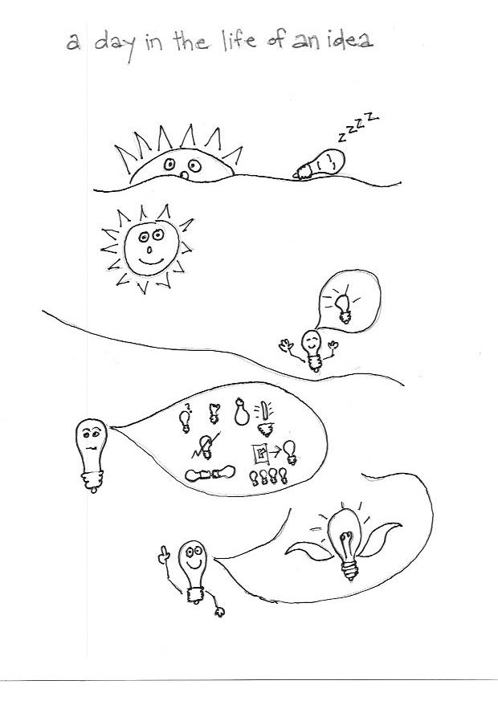

Teaching as Art						01/24/2018

**How do I learn?**

Learning is hard! Teaching is Harder!
'Jack of all trades, master of none'
'I Know a little about a lot, not a lot about a little.'

I am task oriented and learn by defining the criteria and constraints, gather information and set the perameters. I have learned that by having more limitations I have more freedom to be creative and learn.  I would like to believe that I am thoroughly mathematical and scientific about learning, but in reality, at one point I just jump in and try to figure it out intuitively. I am good at listening, though I also like to talk and express my point of view. I want to interpret and broaden the material that is being taught, thinking out of the box and not taking things at face value. But other times I take things at face value and not define or question them, just learn from them.

I use visual cues to help me learn and strengthen my learning experiences that in turn add and reinforce what I am learning. I like to make personal connections and historical references and tie that back to my experiences and how it effects my day to day life. I look at learning as a practical experience, of trial and error and reflect on it and then intellectualize it. How do I tie my shoe, can I tie my shoe, why do I tie my shoe, does it matter if I tie my shoe…the art of tying my shoe. Learning is not an exact science but more amorphous. There is not a one to one relationship from what I am taught to what I learn. When I learn something well and it sticks I can teach it.

I don't like learning out of my comfort zone but will take to the challenge and try and figure it out. Usually once I start on a task is not an easy learning curve, but I find that I learn and grow, slowly and don't realize what I've learned until I am further along and can apply what I've learned to something else which adds to my experience. 

The environment that I learn in is very important. What I am learning and where effects my ability to learn. Learning in nature is the most fulfilling and satisfying and there I use all my senses. I find that what I learn has a more direct connection between me and my surroundings. What I learn in nature is direct and simple in its cause and effect and the more effort I put in the more nature gives back and teaches. Learning how to build a fire in the woods, for instance, takes time and patience and if I do it wrong it won't work and I am cold and hungry. There is also the poetic beauty in the imagination of the flames of the fire that congers up stimulate thoughts.

Lastly, there is wisdom, which is the accumulation of learning as it applies to experience which these days seems to be a little under rated.
