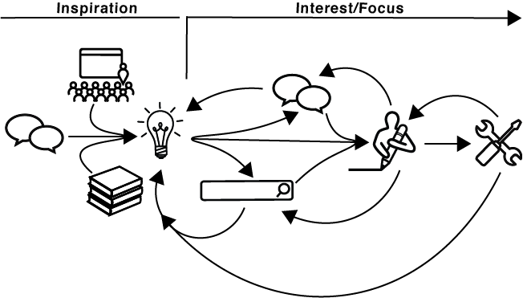

**Ideation vs. Learning**

Reflecting on my learning process mapped above, I couldn’t help but feel I had conflated learning with ideation. But is there necessarily a difference? 

Ideation is the process of developing an idea, while learning is the development of knowledge. I don’t think those are mutually exclusive concepts. In my experience, both involve the accumulation of information, testing concepts, and conversations with peers. While the end results may be different, the processes for ideation and learning are closely linked, at least for me. 

In both learning and ideation, everything starts with a source of inspiration that motivates me to dig deeper into a topic. Interest and the focus that comes with it are key factors in how long I will stick with a topic and whether I will progress onto the next step in my learning process.  Even with sustained interest, the possibility of being side tracked and taken in a different direction is always present, hence the recursive loops throughout the map. 

Let’s dig into the two main component of my learning map:

**Inspiration**

Conversations with friends, peers, and people I admire are my most profound source of inspiration. These conversations open new questions that have at times had a profound impact on my life. For example: it was a conversation with a friend about the threat of giant electromagnetic pulses caused by solar flares that sparked my fascination with manufacturing and mechanical processes, which brought me to New York, which then lead me to ITP.

Other sources of inspiration include lectures or talks I’ve heard and books, articles, essays, etc. that I have read. All of these avenues of inspiration prompt questions that push me to learn more about the topic that piqued my interest. 

**Learning**

For me, learning is a combination of research, conversation, writing, and prototyping. These actions build on each other and start the loop of learning all over again as I discover new paths of inquiry. As I mentioned earlier, my level of interest and focus on a topic is a key driver here. As my interest increases, I go deeper down the rabbit hole of learning. 

My first step to learning something is generally to start by searching the internet. The search bar icon depicted in my map is a proxy for any kind of non-conversational research, but let’s be real: it generally starts with Google. This point on my map, perhaps more than others, can be the most risky because it is common for me to come across something interesting in my research and sink hours into investigating it, even if it isn’t relevant to my initial topic. 

Almost in parallel to my independent research –though often stemming from it– I try to seek out as many opinions, perspectives, and facts from experts and others with knowledge of what I am learning. This takes the form of outreach through phone, email, or social media, and subsequent correspondence. Doing this helps ground my research and pushes me past concepts I may be stuck on.

Once I have collected a body of information on a topic, I like to write out what I have learned in summary form. I take copious notes by hand, on my phone, and on my computer. These are a combination of content drawn from sources, recorded comments from conversations, and my own embellishments. I like to make lists and to break information into discrete parts that are easy to refer back to and share with others. 

After writing and recording, I will try to practice what I learned by building a prototype or project to help reinforce it. This helps me work through my approach and reveals any gaps of understanding, which can lead to more research. As with each step before this, there is the risk that I will discover something new and interesting while prototyping, sending me down another research path, but generally I am so committed by the prototyping stage that I stick with my topic. 

After prototyping, I either move onto another subject or follow one of the many offshoot pathways that I discovered throughout the learning process. Learning is never over, so even after prototyping, there is always more to gather about a topic. And so the learning cycle starts all over again...

*All icons are from [The Noun Project](https://thenounproject.com/) under a Creative Commons license*
