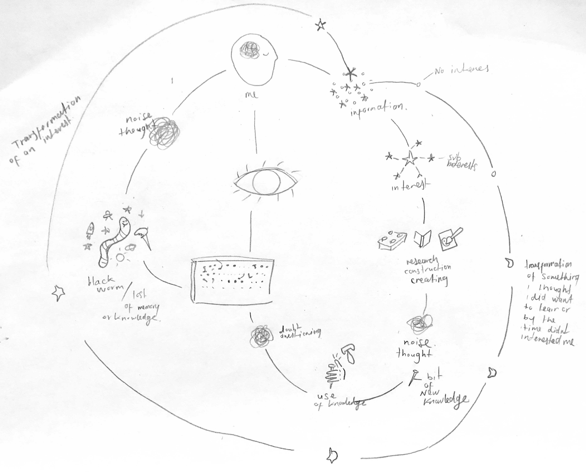
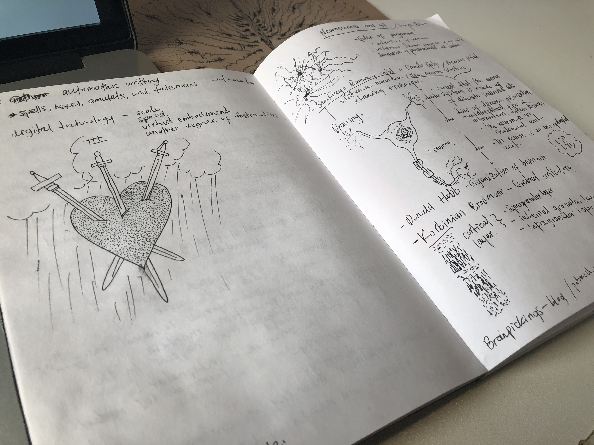

HOW DO I LEARN?

As a child, I often suffered as I guess many other did with school exams. I panicked (which I still kinda do) and usually
confronted these events with fear and anxiety. To be tested or judged on by my knowledge and capacity to learn scared me
; a feeling that is still with me, deep down and although now it frustrates me more than anything, the child and adult in 
me still thinks there is something that doesn’t feel right about that system. 

Before an exam, my mind shut down completely and went blank even with the textbook in front of me, no matter how much I 
read I couldn't  understand or memorize anything. It felt like reading a book whose words disappeared whenever they were 
read; this happened if the subject was difficult or not interesting for me, like math or social science. So, as mischievous
as I could be at that age, I decided I would cheat by writing clues in little pieces of paper… others did it. It is called
“Copia” (to copy) in Spanish and I want you to know I wasn't proud about and I didn't want to get caught by my parents or 
teachers obviously. 

If the point was to know the possible answers under a specific context probably the best option was to memorize information,
to get clues and this clues needed to be as precise as they could. My idea was that a quick look should help me to “remember”
the answers or understand the context of any question in the exam. The modus operandi was the following: I was going to 
1. Read the textbook carefully; 2. Subtract the main information in keywords; 3. Make connections (like a diagram); 4. Draw 
my very own “hieroglyphics”; 5. Review and corrections. Once my copy was done and bulletproof I went over and over again 
through it. 

On the day of the exam, I was ready. With my pen and secret weapon well hidden. I wrote my name on the top-left part of the
paper, tap my pocket to check on my clues and went for it with a little less fear. The first question was easy, no need of 
the “Copia”, the second question I knew the answer as well, the same with the third and the fourth, although the fifth was 
tricky no need of the Copia. By the end of the exam, my little pieces of paper rested untouched in my pockets, I didn't need
them. Imagine my surprise when I got the grade and it was a good one. In my fear of failing and my pursuit of an easy way 
out, I was lucky enough to find a way of learning that was my own. You should see my “Copia” for my art history class final,
its beautiful and probably my best so far: ten little pieces of yellow paper bursting with drawings, dates, anecdotes and 
synopsis. 

With time the Copia transform itself and move into my notebooks, this is how I take notes and do research but know other 
features are incorporated. I took pictures, screenshots, make videos, send pieces of code to my email for safekeeping and
safe links, articles and images for future use.

