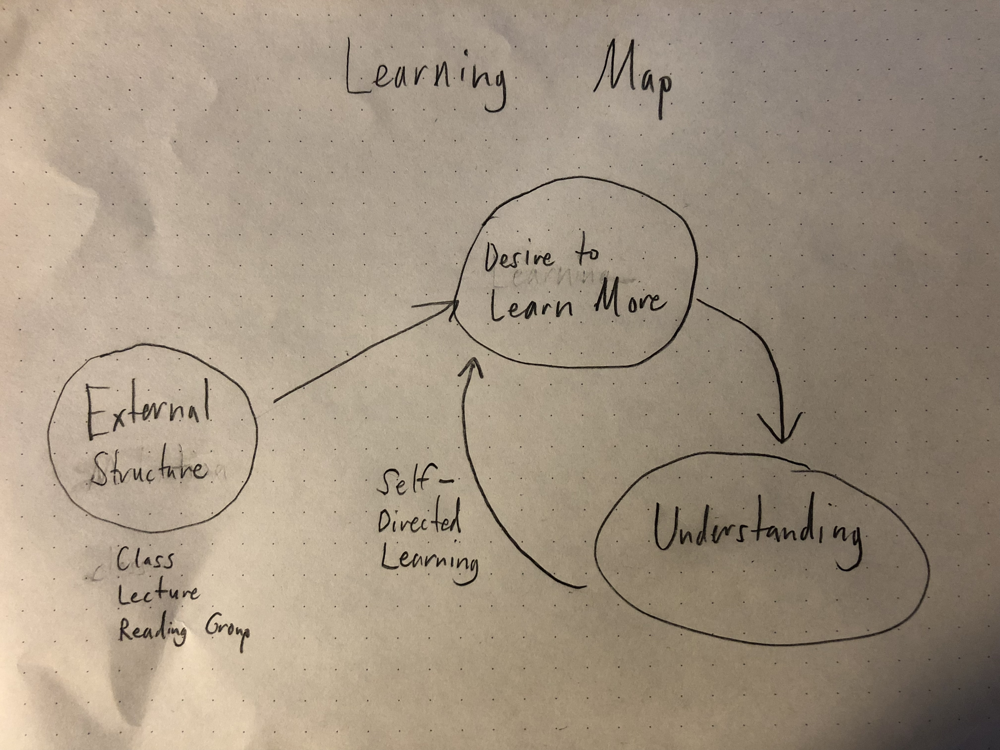

## Learning by Doing

I tend to learn best by doing. I get a lot out of listening to lectures and reading through tutorials, but I think that I understand an idea or concept much better if I can ask questions, attempt to explain it in my own words, or work on a project that explores it somehow. I sometimes struggle to pay attention in long classes that don't have any discussions or interactive elements. Taking notes with pen and paper seems to help with this, perhaps because it requires me to paraphrase what I'm hearing and seeing. Taking notes on a computer works too, but it's easier for me to get distracted.

## External Structure

When I first decide to learn something, I often need some sort of external, interpersonal structure that forces me to get started and keep going, like a class or a reading group. I see graduate school as a way to provide myself with this kind of motivational environment, and I worry sometimes about whether I'll be able to keep learning at the same rate once it's over. I think that the solution to this is to get better at creating my own learning structures, and to seek out communities that help faciliate self-initiated learning.

## Taking Breaks

I think that I process information slowly. When I'm working through a new idea, sometimes I'll get stuck or mentally exhausted, and the only way to move forward to is to take a break, go for a walk or take a nap, and come back to it later. In these situations, it feels like learning is partly an unconscious process. I've found this to be particularly true with regards to learning how to code and learning how to play an instrument.

## Impatience

Sometimes I can be an impatient learner. When I'm excited about a concept or skill, it can be tempting to skip the fundamentals in order to get to something more complex and interesting. This has come up for me recently as I've been teaching myself about computer graphics and shader programming -- I'm very interested in the aesthetics of more complicated algorithms like Perlin noise and fluid simulations, and it's been hard to step back and focus on simple things like drawing a square or mixing colors together. This pattern is obviously self-defeating, because advanced concepts tend to require an understanding of the basics.

## Learning Map

