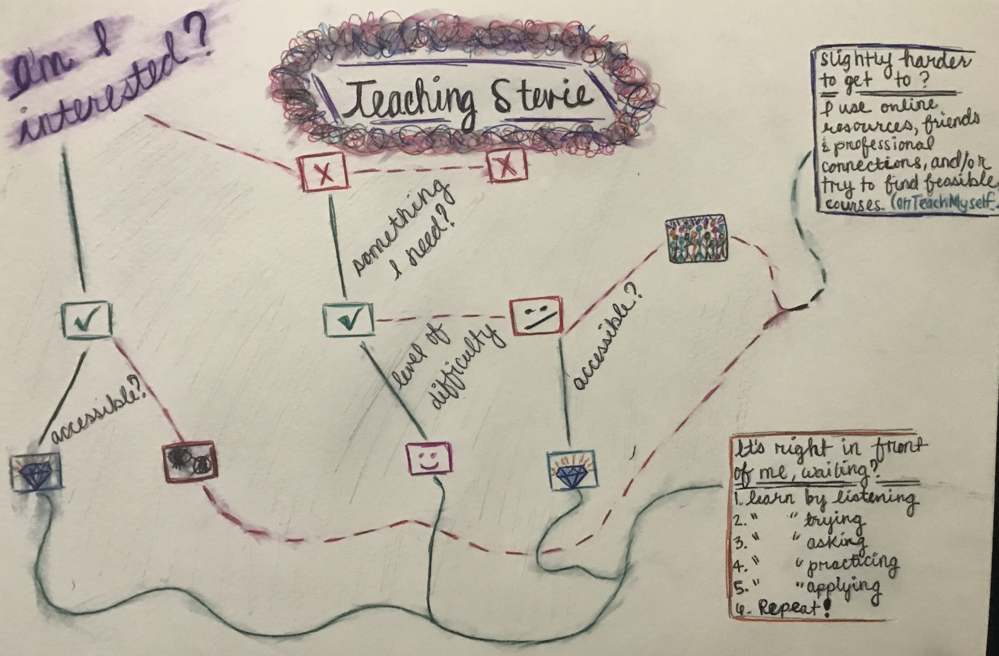

First, I feel obligated to mention that I know that my "learning map" above is inappropriately titled
"Teaching Stevie" when it should be something more like "How Stevie chooses to learn based on the following
circumstances". I also find it important to note that I chose to focus more on the how I get to learning rather
than how I actually learn because in reality, my learning process slightly differs by subject matter. One thing
that does not change is the undeniable fact that my learning style exists at an intersection of kinesthetic and
reading/writing.

With the interest AND demand of learning something new (or improving a skill), having the opportunity to study
be accessible (costly and easy to get to) helps to make things more straightforward for me. It doesn't matter if
I am working with a trained professional, a semi-seasoned tutor, friends who have information (and patience) or
an online resource - what matters is that I can start by listening and taking notes, that I am able to try to
execute the work (if applicable), and that at least some of my questions can be answered. This is the basic
foundation of my learning process. After having the chance to do these things, ideally in this order, continuing
to practice and then apply to "real life" is how I determine whether I learned and retained enough. Because I am
an adaptable human being and an eager student, I understand that not everyone teaches according to my model. If
it isn't a private learning session or my learning partner can't stand to figure out how I operate best, I don't
usually have issues catching on and blending my needs into the conversation so that I can get the most out of
the lesson.

In cases unlike the one I just explained, where the desire and/or need to learn a particular lesson is less than
good (or simply nonexistent), the path and process of learning for me is quite different - though never less than
halfway enthusiastic (I truthfully really enjoy being a student). However, I don't have tons of time to waste, so
if I am neither interested or mandated to pick up a particular skill, I'll likely avoid it. If only one of those
things is true but there is another nuisance standing in the way (ie. it's expensive, not available nearby,
extremely hard to self-teach), I find a way to make it happen. I use every resource available to me - experienced/
knowledgeable connections, free/discounted workshops, or my personal favorite, youtube - and essentially follow the
same "Listen-Try-Ask-Practice-Apply" methodology. I am also a pretty good team-member and will use this to my
advantage when a) it is necessary and b) I know that my strengths and those of the other team-members have a good
chance of producing impeccable work.

If I could choose an adjective for myself, I would say that I am a proud "do-er" type of learner. I sort of jump in,
confident or not, and make things happen. More often than not, I believe that the results are optimum because my
passion for learning and growing is a primary trait of mine. Prayerfully, this is something that continues to
motivate me.
 

  
First, I feel obligated to mention that I know that my "learning map" above is inappropriately titled "Teaching Stevie" when it should be something more like "How Stevie chooses to learn based on the following circumstances". I also find it important to note that I chose to focus more on the how I get to learning rather than how I actually learn because in reality, my learning process slightly differs by subject matter. One thing that does not change is the undeniable fact that my learning style exists at an intersection of kinesthetic and reading/writing.

With the interest AND demand of learning something new (or improving a skill), having the opportunity to study be accessible (costly and easy to get to) helps to make things more straightforward for me. It doesn't matter if I am working with a trained professional, a semi-seasoned tutor, friends who have information (and patience) or an online resource - what matters is that I can start by listening and taking notes, that I am able to try to execute the work (if applicable), and that at least some of my questions can be answered. This is the basic foundation of my learning process. After having the chance to do these things, ideally in this order, continuing to practice and then apply to "real life" is how I determine whether I learned and retained enough. Because I am an adaptable human being and an eager student, I understand that not everyone teaches according to my model. If it isn't a private learning session or my learning partner can't stand to figure out how I operate best, I don't usually have issues catching on and blending my needs into the conversation so that I can get the most out of the lesson.

In cases unlike the one I just explained, where the desire and/or need to learn a particular lesson is less than good (or simply nonexistent), the path and process of learning for me is quite different - though never less than halfway enthusiastic (I truthfully really enjoy being a student). However, I don't have tons of time to waste, so if I am neither interested or mandated to pick up a particular skill, I'll likely avoid it. If only one of those things is true but there is another nuisance standing in the way (ie. it's expensive, not available nearby, extremely hard to self-teach), I find a way to make it happen. I use every resource available to me - experienced/knowledgeable connections, free/discounted workshops, or my personal favorite, youtube - and essentially follow the same "Listen-Try-Ask-Practice-Apply" methodology. I am also a pretty good team-member and will use this to my advantage when a) it is necessary and b) I know that my strengths and those of the other team-members have a good chance of producing impeccable work.

If I could choose an adjective for myself, I would say that I am a proud "do-er" type of learner. I sort of jump in, confident or not, and make things happen. More often than not, I believe that the results are optimum because my passion for learning and growing is a primary trait of mine. Prayerfully, this is something that continues to motivate me.
 
