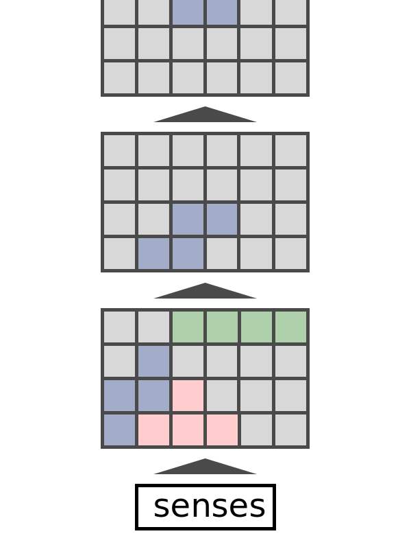

# Learning by doing and writing

[My feelings about how my (mostly) unconscious learning mechanism works.](https://www.vndrewlee.com/posts/teaching_as_art/01_learning_map/)

I use learning for things that are too complicated to easily be specified. If something can be specified easily, I usually store it outside my brain.

Learning requires many attempts at compression and experimenting with conceptual configuration.

## Acquiring a target

Since I focus my learning effort on things that cannot be easily specified, deciding on a target is the first task at hand when trying to learn something.

Using a tangible project as a target is what works best for me as a measure of learning. For example, people often ask each other if they "know something", eg "Do you know Python?". This is a very difficult question to answer head on, but is more easily answered by describing what I can capable of doing with Python, eg "I can make a web app with Python".

Always in parallel to (and sometimes as a substitute for), a project, I also attempt to create an analytical frame to encapsulate the material I am ingesting in order to learn. I also continually, consciously test fit the framework into my broader base of knowledge.

My goal for the project is to create something that meets my personal criteria for quality. My goal for my framework is maximum compression, transferability, and fit with my broader knowledge graph.

## Defining projects

I always start off with the minimum demonstrable project, eg a `hello world!` type tutorial. After that, I try to either pick progressively more complex demonstration to recreate or pick a project that can start simple and expand in complexity that matches that I want to learn.

It's very difficult to find project that expand in complexity that matches my trajectory, so I usually only pick those if they're recommended by a source I trust.

## Writing as both student and teacher

Certain subjects are difficult to demonstrate with a project, so the analytic frame alone must suffice.

I write a document explaining the framework to test the framework for maximum compression and transferability. This could be an essay, a presentation deck, or visual media.

This forces me to think as both teacher and learner. Since I am actively compressing information into the framework and thinking about whether it makes sense / is transferable to someone else.

Shorting, editing, and reducing complexity of the document provides a measure of compression progress. Reader and learner feedback provides transferability feedback.
