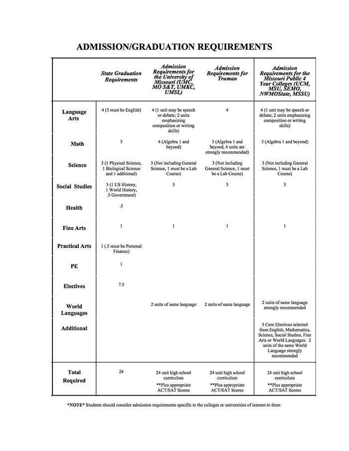
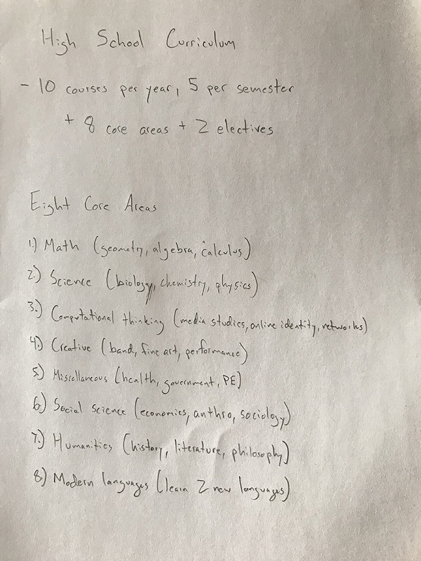

For context, I went to public school in Missouri. I found this list of graduation requirements on my high school's website. I remember this piece of paper very well. I don't remember having to take classes on Practical Arts, but everything else looks the same.

It is important to note that graduation requirements are not a curriculum, but I like this approach toward a more liberal arts curriculum. I'm interpreting liberal arts rather broadly and in a high school context (arts, math, sciences, etc, but also health, physical education), and I would like to include modern adaptations, such as computational thinking as well as diversity & inclusion.

I wish that my 10th grade experience had an explicit focus on communication as a way of obtaining knowledge and as a critical yet complex component of being a member in a diverse community/society. I think communication skills are often considered a by-product of putting 2,000 students in the same building, or something that should be learned at home, but I feel that the environment of a school provides a rich opportunity for practicing and developing those skills with your peers in a safe learning space. Rather than having specific courses on communication, I would like to see creative approaches built into the existing classes so that it’s integral to the learning experience, and not

Philosophy: Students are encouraged to be active participants in their learning process, to take ownership in pursuing their intellectual and creative interests. However, 10th graders are still young and need guidance. The school and its teachers support each student in discovering their interests, and provide the resources and learning environment necessary for engaged, networked learning to occur.

Learning Objective: To facilitate students in the process of self-discovery and to discover their own intellectual and creative interests.

Learning Outcome: Students will be exposed to a wide range of intellectual topics, both as general requirements and through self-chosen elective, and will have a deeper understanding of areas of inquiry they would like to pursue in their final two years of high school. Additionally, students will have strengthened communication skills through networked and experiential learning.

