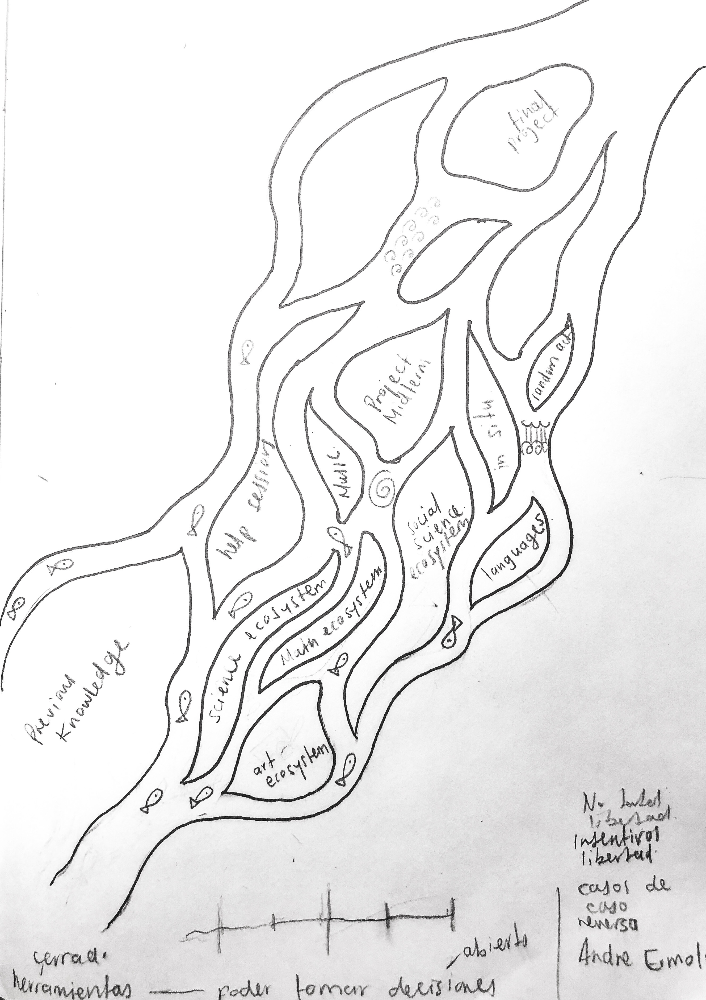

 Curriculum

ART / MATH / SCIENCE / SOCIAL SCIENCE / LANGUAGE/ SPORTS

Students will have lectures on sciences and humanities alike with a 
continuous exchange among them the entire year. There will be six 
main categories of studies, each with subcategories that represents 
a specific line of that category knowledge. Some of these 
subdivisions might be part of the student primary (focus) schedule 
or electives advised accordingly by his/her student advisor. 
The categories are:

Art (Literature, Art history, Music, Plastic arts)
Math (Algebra, Calculus, Trigonometry, Geometry)
Science (Biology, Chemistry, Physics)
Social Sciences ( Philosophy, History, Political Science)
Languages (English, French, Spanish, German)
Sports (Soccer, Volleyball, Basketball, Tennis, Yoga)

Focus courses  will be taken through all the academic year: Literature,
Algebra, Chemistry, Physics, Political science and English, unless an
exam provides proof of knowledge. In that case another language should
be a focus language. 

Elective courses  will be taken through the first half of the year in 
cycles. A general approach on this first semester will provide students 
with more tools.  Enrollment in at least two electives of different 
categories is mandatory after midterm. By that period the schedule will
be different for each pupil. Students will be evaluated from 1 to 5, 
with a minimum of 3,5 as a requirement to pass.

Guided studies
As a potential Course, students might enroll in guided studies; A white
canvas for exploration, intersection and collaboration with other 
students of different years and groups. Each category has a guided 
studies course to allow a deep reflection and experimentation. This 
course is deeply encouraged.

Projects and assignments
As a requirement students must submit one assignment per week for each 
class. There will be four(4) projects through the length of the course. 
One group project as a community with his class members; One project 
given by the instructor; One project proposed by the student a final
project. Final projects can be hybrids, meaning the can merge as final
with other 
courses.

The river ecosystem: "The following unifying characteristics make the
ecology of running waters unique among aquatic habitats.[4]

-Flow is unidirectional.
-There is a state of continuous physical change.
-There is a high degree of spatial and temporal heterogeneity at all 
scales (microhabitats).
-Variability between lotic systems is quite high.
-The biota is specialized to live with flow conditions"
https://en.wikipedia.org/wiki/River_ecosystem
