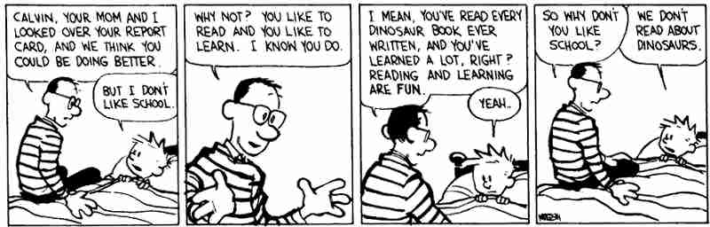
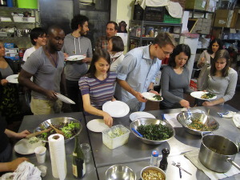

# Curriculum For Myself as a High School Sophomore

## Personal Experience

Like many others, I didn't have a great experience in the U.S. school system. My time in high school was oriented around getting good grades in preparation for getting into a good college, even though I wasn't really sure why that was important at the time.

School encouraged me to define my self-worth in terms of my intelligence and academic performance, and I struggled with perfectionism. I came to think that I was only good at a narrow range of things, and that it wasn't worth learning other subjects because I didn't have an aptitude for them.

I also had a hard time developing social skills, and I internalized a lot of harmful beliefs and behaviors that had to be unlearned later in life.

## Teaching Philosophy

The teaching philosophy of my curriculum is based on the idea of a liberal arts education. My intention is to provide students with a diverse array of knowledge, and to allow them to pursue the areas that interest them most, while still exposing them to certain subjects that I consider to be important and worthwhile.

I would like to encourage students not to feel that they have to be good at any one particular thing, but instead to enjoy learning for the sake of learning. I would like to create an atmosphere in which mistakes are accepted as a natural part of the learning process.

My hope for my curriculum is to instill a curiosity about the world in my students.

## Learning Objectives

Students will learn to critically evaluate the society in which they live. Students will learn to question the dominant narratives of history. Students will read a wide variety of literature, philosophy, political theory, and poetry, including writing by women, queer people, people of color, indigenous people, and people with disabilities. Students will learn how to refine and communicate their ideas through writing.

Students will learn to think computationally. Students will learn programming and basic electrical circuitry, and will be encouraged to apply this knowledge to other scientific and artistic disciplines.

Students will learn to think mathematically. Students will be taught the basics of mathematical proofs and the relationships between math, philosophy, and visual art.

Students will learn how to express themselves creatively through an artistic medium of their choosing, e.g. drawing, music, dance, film, photography, animation, games, or sculpture. Students will learn the history of their art form and will contextualize contemporary work within that history.

## Learning Outcome

Students will learn how to learn and will be empowered to direct their own education, with appropriate guidance. Students will achieve independence, but also interdependence; they will better understand how to be part of a community. Students will make connections between multiple disciplines.

## Examples of Classes

### Cooking

Students will cook meals, eat, and clean the kitchen communally. I had this experience in college for several years, and it changed the way that I thought about what it means to be in community with others. Cooking for and being fed by your classmates teaches responsibility and self-sufficiency, while also demonstrating that being responsible for others can be a source of joy.

### Shop

Students will make objects with their hands and with power tools, with appropriate supervision as necessary. In this class, students will come to understand the processes by which the things around them are designed and fabricated, and will consider the relationship between engineering and the environment. Students will be encouraged to combine projects for this class with other subjects such as art, design, physics, or computer science.

### Athletics

Athletics classes will encourage students to develop a healthy relationship with their bodies, and to view exercise as a type of learning. Yoga and meditation classes will be offered. Competitive sports will be available for those who want them, but will not be required.
