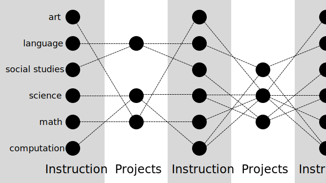
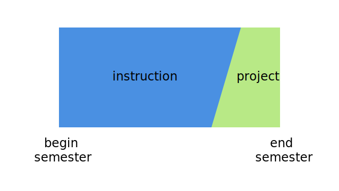

> Assignment: Design a curriculum for your young self, high School sophomore. Write about the curriculum, include teaching philosophy, learning objective and learning outcome. 500 words and 2 images.

<!--more-->

## My high school experience

My personal experience in high school was that I had difficulty connecting grades on exams and papers with real world outcomes. I felt no impact outside of the reaction from my parents when my report card came home.

Also, as a teenager, the time of high school felt extremely long. The next year felt far away. The previous year also felt far behind, where I was very different person. It was beyond my ability to project myself 5 years into the future where I could evaluate the quality of my effort and education in high school.

My curriculum attempts to ground education and quality feedbacks by using projects as stakes.

## Teaching philosophy

The main focus on my curriculum is on projects at the end of each semester.

- each class the student is taking must be involved in at least one project
- each project must include at least two classes

The projects must demonstrate understanding of the materials in their associated classes.

Outside volunteers from the community will be used for feedback on projects while under development and during a final presentation. Volunteers will be selected based on experience with applications of subject materials.

The flexibility regarding courses and content are to allow for each community to adapt the principles to their own values. It also accepts that values may change over time and subject matter emphasis over time as well.

It also allows localizing for accreditation standards.

## Learning objective

The main objective is demonstrable understanding of course materials through project based application. Understanding can be demonstrated via analysis, critique, synthesis, or application of the course materials.

The quality of education should enable a wide freedom of choice in deciding what the student wants to do after high school.

## Learning outcome

The outcome goal is independent learners and teachers that are capable of creating an ecology of learning wherever they go onto after high school.

They should be capable to contribute back to the communities self-selected as an adult.

## Projects

- The projects will be done in a 4 week sprint at the end of each semester.
- Regular instruction and the project spring will overlap by one week, where project work gradually ramps up.
- Feedback will come from community volunteers, regular instructors, and fellow students.
- Final projects are presented during the final class session

## Ecology outside of projects and work

Supporting structures of administrative functions, cooking food, exercise, and spiritual / mental health should be provided to students and make themselves available to partake in student projects.
