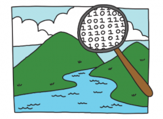

*Computational Thinking*

Meets daily, Monday - Friday

3rd period, 11:10am - 12:00pm

Computational Thinking gives students an understanding of both how computers work and how computers impact society. Given that computers form an increasing amount of our infrastructure and are required in order to perform the basic functions of day-to-day life, it is critical that students develop a basic literacy of how these machines function. By alternating between classroom discussion and hands-on labs, students will gain the knowledge necessary to become more critical consumers (and producers) of information, which will enable them to make more informed decisions.

*Week 1: What is a computer?*

This week we will go over the history of computers and define what a computer is. We will also begin exploring how computers have had an impact on society and culture

*Week 2: Lab week: command line and programming basics*

Meet in the computer lab this week. We will begin by learning about Unix and how to use the command line. Halfway through the week we will switch to introductory programming, introducing the concepts of variables and for loops.

*Week 3: Algorithms*

Define algorithms and discuss non-computational examples. We will all examine computational algorithms for recommendation (Amazon and Netflix), optimization (elevators), and search (Google), and also discuss how algorithms determine our social media feeds (Instagram, Facebook).

*Week 4: Lab week: media creation and editing*

Meet in the computer lab this week. Begin by learning how to create media, including digital photography, audio, and video. Afterward, we will learn how to edit media and for what purposes.

*Week 5: Bias in the machine*

This week we will discuss the impact of bias in technology, from Silicon Valley culture to whether an algorithm can embody racism. Develop understanding of how everyday technologies can advance dominant narratives of society.

*Week 6: Lab week: programming basics, continued*

Meet in the computer lab this week. We will continue learning programming basics from week 2, including if statements, arrays, and functions. By the end of the week, students will build design and build/program a game that incorporates skills and ideas learned from the previous six weeks.
