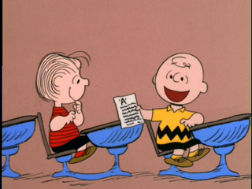

## Week 3's homework assignment ##

Design a curriculum for a 6-weeks class in your high school.

- Design a syllabus for a class in 'your high school.' Contextualize the class within the curriculum you designed. Focus on the learning outcomes (tangible takeaways) while thinking about the learning objectives. You can also update your curriculum from last week.
- The syllabus needs to include a class title, description, and schedule. Please follow the [syllabus worksheet](https://github.com/tchoi8/teachingasart2018/blob/master/lectures/SyllabusWorksheet.md)
- 500 words & 1 image
- Follow the file naming convention of firstname_last_name.md
- Please submit by 2.11 - Sunday 10am.
- In class next week we will return to our same partners and you will present your syllabus from the perspective of a teacher (or a schoolmaster.) Your partner will give feedback from the perspective of a student and vice versa. After, in partner-pairs, you will discuss your syllabus for the whole class.

Note: Regarding the Syllabus Worksheet, some students asked about the distinction between information and knowledge. Information is explicit, contained, discrete. Knowledge is implicit, intertwined and process. Students gaining awareness of certain fact or skill would be in the realm of *information.* Student understanding the information nd making empowered choice on their own would be based on their *knowledge* about it.

As you know, we’ve been thinking of a classroom as a form of community - and community spaces as a form of classrooms. The [assigned reading](http://towery.lehman.edu/PhotoTopics/Photo%20Topics%20readings/Weeks34PPabloHelgueraEducationforSociallyEngagedArt.pdf) from last week asks us to think about the goals of socially engaged art. **Please come to class prepared to discuss the following prompt:** What is the goal of your syllabus, especially if you’re considering the class as a community?  

For future classes, we will move our discussions more towards artists and artworks as educators. As an introduction to some of the artists we will be talking about please read/watch:

- [Who is Joseph Beuys?](https://www.youtube.com/watch?time_continue=36&v=e7pIGGcIoLk)
- [National Galleries Joseph Beuys Learning Resource](https://www.nationalgalleries.org/art-and-artists/features/joseph-beuys-learning-resource)
- [Lygia Clark - Breath with Me at MoMA Studios](https://www.youtube.com/watch?v=XG2qmCYQ7Ps)
- [NYTimes review of Lygia Clark's show at MoMA](https://www.nytimes.com/2014/05/16/arts/design/lygia-clarks-many-twists-and-turns-at-moma.html)
