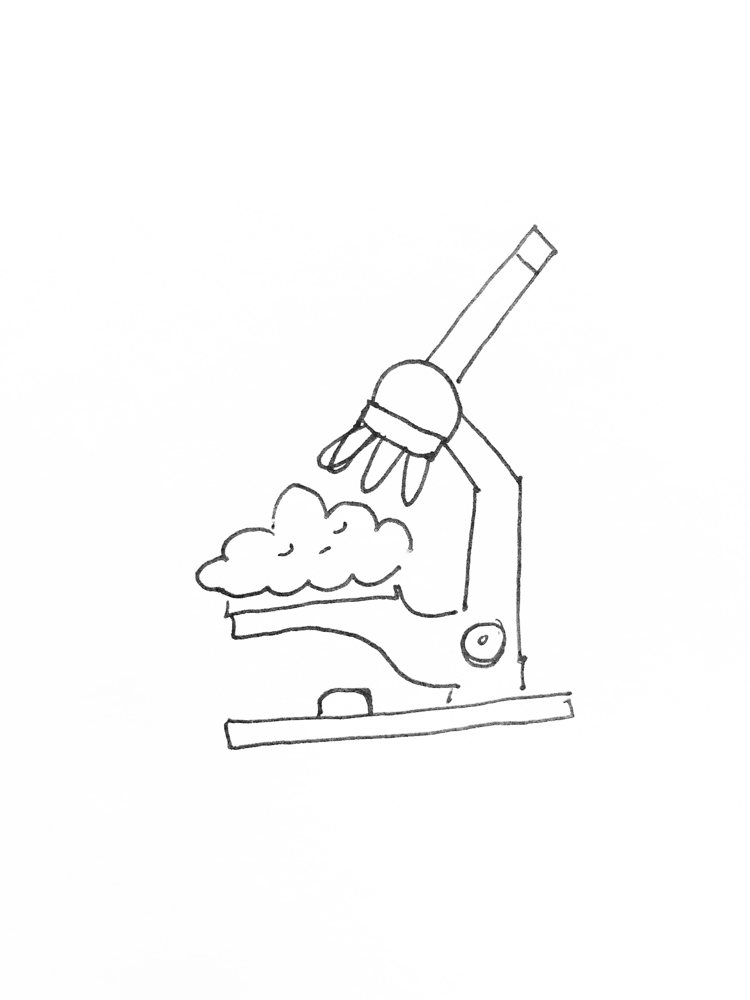

Syllabus

CLOUD POEMS AND INCOMPLETE THEOREMS

(Elective - 6 weeks - 2 credits)

 Cumulus
 
“Still soaring, as if some celestial call
Impell’d it to yon heaven’s sublimest hall;
High as the clouds, in pomp and power arrayed,
Enshrined in strength, in majesty displayed;
All the soul’s secret thoughts it seems to move,
Beneath it trembles, while it frowns above.”
Goethe

DESCRIPTION

Johann Wolfgang von Goethe was one of the most celebrated intellectuals of the 19th century, as a writer 
he was a bursting talent and a jewel for his country, but Goethe’s prose not only flourished in his novels 
but in his scientific work. He wrote poems to the clouds, to the plants, to  the forms of nature. In this 
class, students will learn about the history of different branches of science, their the impact or interweaving with the art, society and culture. We’ll discuss and elaborate around the contributions of 
biologist, mathematicians, composers and even actors. Readings, sketching, experimentation and in class 
lectures will give place to projects, the crazier the better. 

MATERIALS

Readings will be provided to the student. A sketchbook is mandatory for all students of this class. 

ATTENDANCE

You are expected to attend all the sessions, if for medical or personal reasons you are unable to attend 
please inform in advance. Three unexcused absences will make you fail this class.

ASSIGMENTS AND PROJECTS

Two sketchbook entries (illustrations, poem, doodling, etc) per week.

200 to 250 words response to the readings and class

One 5-1o minutes presentation about a topic/scientist/artist you want and is relevant under the context of 
the class. Two per session.

One “all” students project (given by the instructor)

One final project has no requirements, it can be an experiment, a compilation of poems, even a painting. 
Just remember this is a final project and as such it must demonstrate your knowledge and understanding of 
the class. You must document your final project in digital and create a presentation of at least 15 minutes 
for peer review.

SCHEDULE

SESSION 1

 
Clouds, physics laws and Goethe

Introduction and syllabus

How are clouds born? Who was Goethe? Why he wrote poems to the clouds? Can a scientific paper be written 
in prose? / Cloud observation and classification on class while reading Goethe’s poem to each.

Readings: The invention of clouds, Richard Hamlyn. Chapter 1.
Essay on the modifications of clouds by Luke Howard. Pg 25 - 42

SESSION 2

Darwin, Haeckel and wonder-rooms

Darwin’s revolution an it effect on society. Illustration as a media of scientific study. Private collections 
and the general public./ Scientific illustration on class

Presentation
Readings: The origin of species, Charles Darwin. Chapter 3

SESSION 3

Electrocuted elephants and movie stars; Tesla and Hedy Lamarr

Tomas Edison vs Nikola Tesla fraud. Patterns, propaganda and physics. Hedy Lamar, from Hollywood to the Wifi
/ Tesla  coil experiment

Presentation
Group project due (Class Wonder-room)
Readings: Electronics for kids. Chapter 1

SESSION 4

Gödel, Escher, Bach

Bach canons and fugues, the mathematics behind Bach’s compositions. Escher and geometry. Gödel’s incomplete 
theorems / Musician guest
Presentation
Readings: Gödel, Escher, Bach; An Eternal Golden Braid, Douglas Hofstadter. Introduction

SESSION 5

Neuroscience and ink

How does the brain work? Memory, chemistry and electricity / Microscope drawings using Golgi's staining on 
tissue - File trip after class to the NYU Grey Gallery The Beautiful Brain: The Drawings of Santiago Ramón 
y Cajal 

Readings: Proust Was a Neuroscientist, Jonah Lehrer. Chapter one

SESSION 6

Bacteria as new media

Bacteria in museums and nature as material and research. Biology in architecture, art, design and fashion. 
From Neri Oxman to Iris Van Herpen and Sonja Baumel

Final project

SESSION 7

Sketchbooks exhibition 

