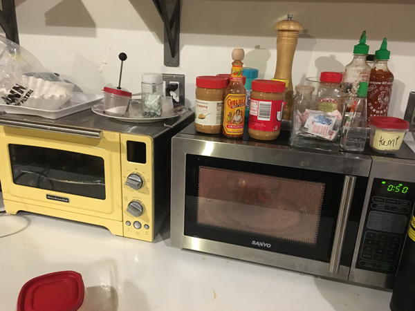

## How To Boil An Egg at ITP

### Summary

This is a syllabus a 20 minute workshop on for how to boil eggs in a microwave while learning about how to navigate and maintain the kitchen at ITP

**Learning objectives:** Teach how to boil an egg and basic maintenance of the ITP kitchen space

**Learning outcomes:** Student gains an understanding of cooking in an unconventional setting and a respect for taking care of shared spaces

**Expectations:** For the lesson, the student will be open to learning and building upon their past experience of boiling eggs

### Lesson Plan

**(2 min)** Briefly go over general rules/expectations of the ITP kitchen.
* Clean up after yourself
* Share space
* Don’t be a jerk

**(2 min)** An introduction to the available equipment at ITP and where things are located
* The microwave
* Electric kettle
* Sink
* Bowls and plates
* Dishwasher
* Paper towels
* Garbage

**(10 min)** Demo how to boil the egg while student follows along doing the same
* Boil water in the electric kettle
* Get a microwave safe bowl that is deep enough to hold the egg(s)
* Place egg(s) in the bowl and then add boiling water so that the eggs are completely submerged
* Put 1 tablespoon of salt into the bowl and gently mix
* Microwave the eggs for 3 to 6 minutes. Watch the microwave to make sure the eggs don’t explode.
* Once your eggs are done, carefully remove the HOT bowl and let it cool.

**(5 min)** Demo proper clean up while letting eggs cool. If there is time while the eggs cool - casual discussion on the production of eggs.
* Wipe up the microwave if there was any splatter
* Wipe off the counter
* Show where to place the bowl and any plates for when we are done eating

**(1 min)** Eat eggs and put away dishes.

**Extra Readings/References:**
* https://www.wikihow.com/Hardboil-Eggs-in-a-Microwave
* http://fortune.com/mcdonalds-cage-free/

### Feedback and Notes from Ridwan
* Too much preparation and focus on cleaning in the beginning especially
* Thinking about other items you could use alongside the microwave to accomplish this task
* There should be an experimental aspect - how many eggs could you microwave at once?

I agree that my plan for the lesson was a little procedural and didn't contain that many unexpected elements. We also talked about ways that boiling eggs can be a metaphor and tie the lesson to other topics.
