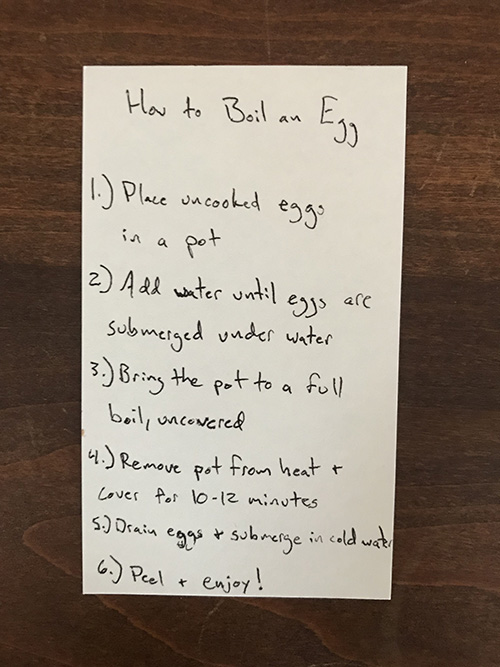

Below is the syllabus for my egg boiling session with Oren.

### Syllabus

#### Benefits of eggs

**Eggs as part of a healthy diet**
- I know you've wondered wheather you'll be able to maintain a motivation for learning once your outside of grad school
- While it's not about learning a new technology, I want to provide a motivation for maintaining a healthy diet this is intented to put eggs in the context of a healthy lifestyle
	
- Eggs are good source of protein, and they're not meat
- Eggs have Good Fats: monounsaturated and polyunsaturated fats, or MUFAs and PUFAs
- Good for your eyes: they are a rich source vitamin A
- Good for your bones: they have lots of vitamin D

#### Give overview of steps

#### DIY learning
- Give my handout with instructions to Oren and ask him do it himself
	- You've mentioned that you learn best by doing
	- I want to give you the experience of doing it youself so that you can make it your own process

#### Post-boil follow up
- Any questions or comments?

#### Commentary
Oren gave me the following feedback:
- He appreciated having the handout and having the hands-on nature of doing the activty himself
- Providing information about the nutritional value of eggs was helpful for understanding how this exercise fits into a bigger picture
