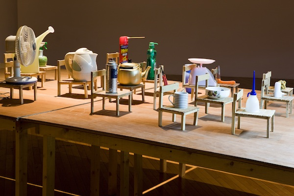

**10 Minute Professor**

- Activity in a pair
- Everyone will have a "learning map and autobiography of a learner" of their partner via [link](https://github.com/tchoi8/teachingasart2018/tree/master/assignments/1_Learner)
- You have 10 minutes to teach your partner how to boil an egg. This can be flexible and longer than 10 minutes
- You need to write / draw the syllabus and notes for pedagogy
- After the session, your partner will teach you for 10 minutes
- You give each other feedback about their syllabus and pedagogy

In case you don't know... 

**How to Boil an Egg**

1. Place uncooked eggs in a pot. 
2. Add water until eggs are submerged under the water
3. Bring the pot to a full boil, uncovered
4. Remove pot from heat and cover for 10-12 minutes
5. Drain eggs and submerge in cold water
6. Peel and enjoy!

Homework posting guideline

1. Make a pull request with a documentation on your pedagogy of "How to Boil and Egg" with your FirstName_LastName.MD 
2. Try not to make more than 5 commits before making a pull request. Commits are not 'save' an they should be used to mark signigicant changes in the document. 
2. Credit your partner and include feedback from your partner (You can write their feedback, or ask them to contribute to your reposity)
3. Include photo or video of teaching process 

In class, you will give a short talk on the pegagogy and lesson process. 

Kim Beom, “Objects Being Taught They are Nothing but Tools” (detail), 2010. Installation view at Artsonje Center, Seoul. Courtesy the artist and SAMUSO, Seoul. Photo: Myungrae Park.