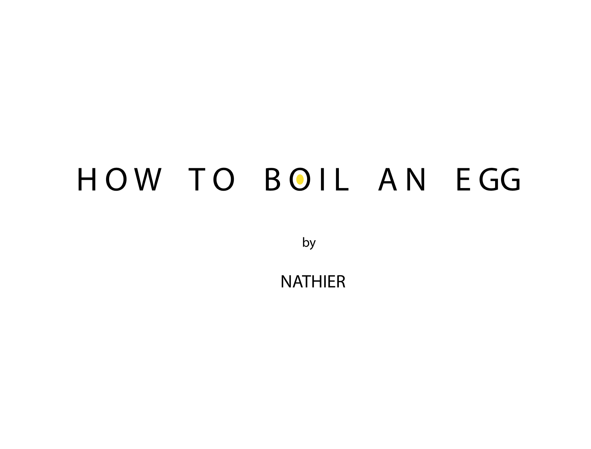

 

There is a cooking tv show that is called “Cooking with a dog” I kind of felt the same vibe 
while doing this exercise or the video following Nathan’s method of boiling an egg. 
We decided to create a presentation for the other. He took a more scientific approach, mine 
was more hands-on, he had a lot of written information, mine was a step by step with 
photographs of the process. Our views on how to teach each other were really different and I 
believe it made the experience more interesting. 

 

First, we shared our presentation whit each other, explaining step by step. Give some feedback 
about the way the info was displayed or should be followed. For example, mine didn't have any 
instructions, just step by step and some of my utensils were the same colour. How too know which 
is the hot or cold water? Some very specific distinctions were necessary for mine, while Nathan's 
has a lot of interesting chemistry processes that occur while boiling an egg, but they were 
introduced at the beginning of the presentation. Probably giving this information in the moments 
that such changes occur during the cooking process will make them easier to understand the 
science behind.

 

