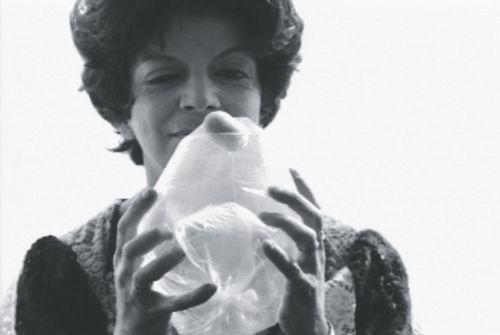
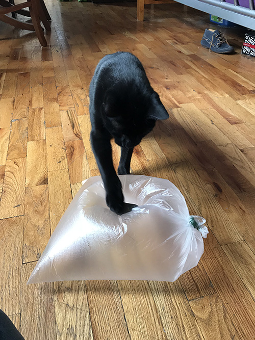

**Learning Objective**: to facilitate an experience with Lydia Clark's piece Pedra e Ar (Stone and Air)

**Learning Outcomes**: participants will learn about Lydia Clark's work, her role in the Brazilian art scene, and the specific context for this piece. Through the experience of engaging with an interactive piece compososed of "sensorial" objects, participants will gain their own understanding of the piece - at a physical and intellectual level.

**Syllabus**

1. Facilitator discusses Lygia Clark's development as an artist and her relationship in the Brazilian art scene
2. The piece is introduced and participants interact with it
3. Afterward, there is a guided discussion among the participants about their experience with the piece

**Pedagogy**

Today we will engage with Brazilian artist Lygia Clark's piece, Pedra e Ar, or Stone and Air. Clark's work sought to redefine the relationship between art and society by dealing with inner life and feelings. She emerged as an artist through her work in Brazilian art movements in the 50s and 60s, including Concretism, Neo-Concretism, and Tropicalia

The year 1966 marked a significant turning point in her art work. After 1966, Clark claimed to have abandoned art, and began working with what she called "sensorial objects." The piece we will perform today comes from 1966, early on during this time of change, and this is her sensorial object.

In particular, this piece was inspired by an incident of physical trauma to Clark's body, and the body is represented here by the stone

To perform this piece, each of you have a bag and a stone. The instructions for the piece are to fill the bag with air, close the bag with a rubber band, and place the stone over one of the edges of the bag. Next, with you two hands, slowly push the bag in and out so the stone goes inside the bag and back outside

Now I invite each of you to do this process yourself. We'll take around 5 minutes for this, so take your time and find what works best for you, your bag, and your stone.

*Optional music component*
Please continue your experience with the piece. But I want to also play a song written by the Brazilian musicisian Caetano Veloso about his experience with this piece. It's called [If You Hold a Stone](https://www.youtube.com/watch?v=B33vXxUpMz8). Like Clark, Veloso was also in exile in Europe during this time, away from the repressive military dictatorship in Brazil. Please continue.

I wanted to take a few minutes to hear your experience with the piece. For Clark, the moving in and out of the stone represents the birth process, of being brought to life. The bodily trauma I mentioned earlier was referencing a car crash that Clark was in. She broke her arm, and the doctor told her to put a plastic bag over her arm to regulate the temperature She removed the bag and put a stone in it. So the piece began with the fracture of her body and became a healing object.

*Discussion*
1. Did this intention resonate with you?
2. Were there other insights you got out of the piece?
3. Do you think "sensorial objects" like this are effective in addressing your inner life and feelings?

