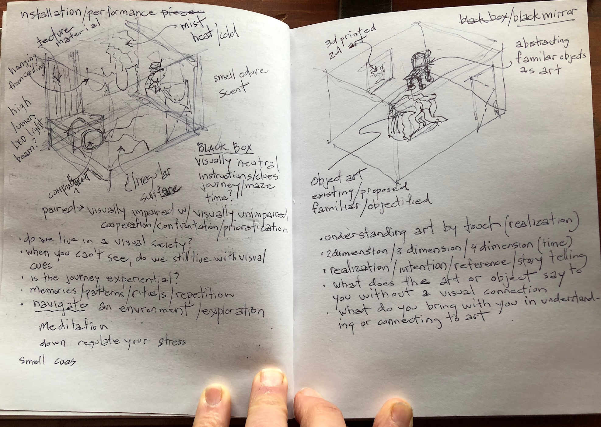

## Black Box Black Mirror - draft proposal

### A non-visual workshop

In this workshop the intention is to explore an environment and art without a visual reference. The 'Black Box' is devoid of any light and as you move through the space you need to use your other senses as cues to navigate. The 'Black Mirror' is devoid of any visual reflection and how does it make you feel experiencing art by touch and not sight. So much in society is given by visual cues and the use other senses such as sound, touch, smell and taste are usually secondary or inconsequential afterthoughts. The American Disability Act is a civil rights law that prohibits discrimination based on disability, giving easier access to society but not taking advantage of enhancing other sensory cues. Are we experiencing less by overriding other senses with what we see?

The workshop has two self-contained rooms devoid of all light and separated from the outside of all senses. The 'Black Box' creates an environment using all surfaces to navigate by touch, sound and smell. The 'Black Mirror' is art in the dark, exploring two dimensions in three dimensions, exploring three dimensions by touch and exploring the dimension of change like growing, shrinking or movement.

The workshop is to couple visually impaired and non-visually impaired people to experience together. The experience, in real time, will be sound recorded and heard outside the boxes as a learning tool for the workshop to enhance and codify and educate. 

Reference reading

[5 innovative ways art is becoming more accessible to the blind community](https://mashable.com/2016/12/29/art-accessibility-blind-low-vision/#d5XK0CzQLmqi)

[Art Beyond Sight](https://books.google.ca/books?hl=en&lr=&id=B4ioCFic7m0C&oi=fnd&pg=PA11&dq=blind+students+in+the+visual+arts&ots=YmfG0lNGBE&sig=6Rx7Ao6O5mHT74CXtAnJlhWGVRU#v=onepage&q=blind%20students%20in%20the%20visual%20arts&f)

[Orientation and Mobility](https://books.google.ca/books?hl=en&lr=&id=r1i1nrwnZL0C&oi=fnd&pg=PR7&dq=environmental+art+and+the+visually+impaired&ots=2NgwIDPB1n&sig=Z7syWkQKVjaoqMPUN7LjbXgs0cY#v=onepage&q=environmental%20art%20and%20the%20visually%20impaired&f)

