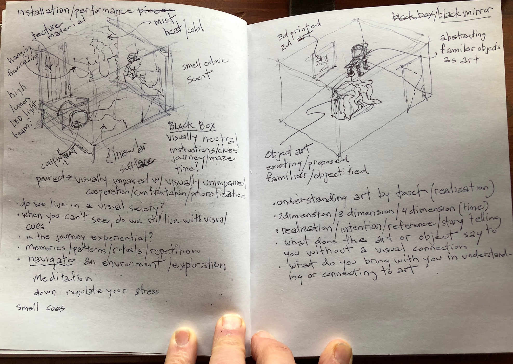

# Black Box Black Mirror 

## A non-visual workshop

A workshop to partner visually impaired and non-visually impaired people to navigate an 'environment' (contextual) and to explore 'art' (object) without light. The Black Box is devoid of 'visual reference' and partners navigate the space by touch. The Black Mirror is devoid of 'visual reflection' and the partners experience art by touch. So much information in society is given by visual cues so are visually impaired and visually unimpaired people on equal footing without light? The workshop enables cooperation while the partners experience an environmental and reflect on art by touch. 

How do we navigate our environment without light? The American Disability Act creates an environment giving easier access for those with visual disability. The sense of change in planes going up a ramp, or the touch of raised numbers and braille in elevators, or the change in texture for pedestrian traffic lights help navigate and move through the environment. The use of these cues enhances the urban experience and reduces the danger.

Most art in museums or public spaces are to be seen and not touched. You stare at, contemplate and reflect upon art with no further sensory engagement. Touching art enhances the meaning, further engages the person and reinforces their reflection. Should art only have a visual reference unchallenged and enhances by the sense of touch.

## Workshop Curriculum

One day workshop for 10-12 people partnering visually impaired with visual unimpaired people

The objective is to create a safe environment for exploration by touch.

The 'Black Box' is creating a contextual environment to explore and navigate by 
touch. The surfaces are hard soft, warm, cold, rough and undulating. The partners cooperate to help each other understand navigate and explore the space.

The 'Black Mirror' is to explore art as object by touch. 
Three types of art
Sculpture - size and space understanding the 3-dimessional perspective
Painting - 3-dimensional printing representing the surface, narrative and color
Functional Objects - furniture and furnishings as art

Each partners experience is recorded. The workshop concludes with listening to the recordings and a discussion based on the experience.

 
## Reference reading

[5 innovative ways art is becoming more accessible to the blind community](https://mashable.com/2016/12/29/art-accessibility-blind-low-vision/#d5XK0CzQLmqi)

[Art Beyond Sight](https://books.google.ca/books?hl=en&lr=&id=B4ioCFic7m0C&oi=fnd&pg=PA11&dq=blind+students+in+the+visual+arts&ots=YmfG0lNGBE&sig=6Rx7Ao6O5mHT74CXtAnJlhWGVRU#v=onepage&q=blind%20students%20in%20the%20visual%20arts&f)

[Orientation and Mobility](https://books.google.ca/books?hl=en&lr=&id=r1i1nrwnZL0C&oi=fnd&pg=PR7&dq=environmental+art+and+the+visually+impaired&ots=2NgwIDPB1n&sig=Z7syWkQKVjaoqMPUN7LjbXgs0cY#v=onepage&q=environmental%20art%20and%20the%20visually%20impaired&f)

[Dialogue in the Dark](http://www.dialogue-in-the-dark.com/)
