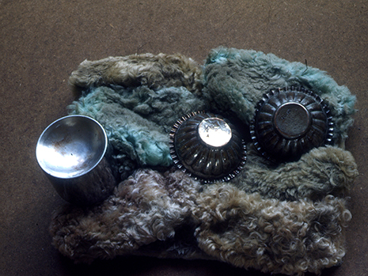
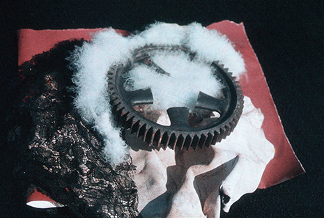
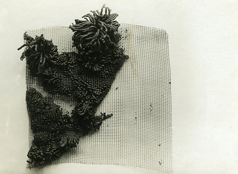
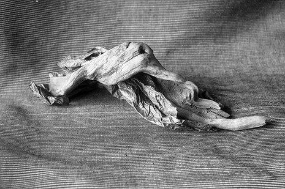
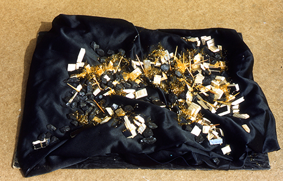
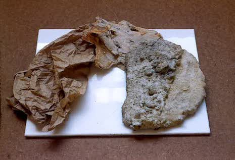

# Midterm Proposal: Matière and Tactile Sensibility

"Just as only a trained eye and a receptive mind are able to discover meaning in the language of colors, so it takes these and in addition an acute sensitivity to tactile articulation to discover meaning in that of _matière_. Thus the task today is to train this sensibility in order to regain a faculty that was once so naturally ours." - Anni Albers, _On Weaving_

A workshop based on the teachings of Anni Albers, intended to develop participants' haptic awareness of _matière_, the sensations and surface qualities of tangible materials.

## The Workshop

Participants will be provided with found materials from the surrounding area, e.g. paper, sticks, stones, wood shavings, fabric, wire mesh, lace, flowers, plastic, electrical components -- whatever is readily available.

Participants will experiment with creating order, composition, and juxtaposition out of these materials, perhaps by grouping, cutting, curling, twisting, tearing, perforating, scratching, squishing, stretching, or otherwise deforming them.

In particular, think about patterns and visual rhythms of horizontals, verticals, and diagonals, but don't worry about color.

## References and Suggested Readings

[Anni Albers, _On Weaving_, Ch. 7: Tactile Sensibility](https://books.google.com/books?id=J7ryDBQPOO4C&lpg=PA1&pg=PA63#v=onepage&q&f=false)

[Fritz Horstman, _The Preliminary Course and the Matière_](http://www.theartsection.com/albers---the-matire)

[Christina Glover, _Anni Albers's Modernist Philosophy in Thread and Text_](http://diginole.lib.fsu.edu/islandora/object/fsu:185061/datastream/PDF/view)

[The Josef & Anni Albers Foundation, _Student Work_](http://www.albersfoundation.org/teaching/josef-albers/student-work/)

## _Matière_ Examples

