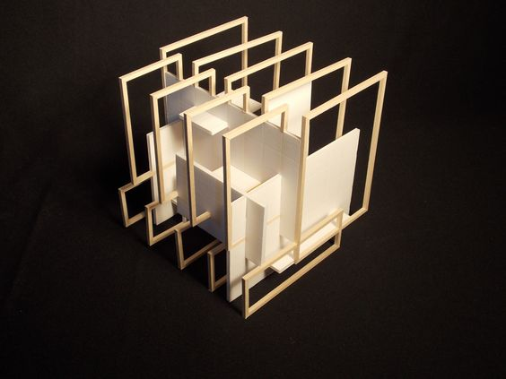

# Workshop Proposal: Medium, Process, and Form

"Acceptance of limitations, as a framework rather than a hindrance, is always proof of a productive mind." - Anni Albers, _On Weaving_

This is a workshop inspired by the teachings of Anni Albers, intended to explore the idea that form can emerge from the interaction between medium and process, and to facilitate creativity within a narrow set of constraints. This workshop also aims to familiarize participants with Anni Albers' life and work, and to contextualize her practice within the Bauhaus school, Black Mountain College, and broader movements in 20th century art.

**Duration:** 1 hour
**Maximum Number of Participants:** 15

## Schedule

### Presentation and Discussion on Anni Albers (10 minutes)

- Historical context of the Bauhaus school
- Weaving, abstraction, and industrial mass production; the intersections of craft, design, and art work
- Focus on experimentation with material and process
- Black Mountain College and teaching

### Individual Exercise (15 minutes)

Participants will be given hot glue guns and several sticks of bass wood and will be asked to start building a structure of their choosing, about the size of a coffee cup. The goal is to practice "sketching" with the provided materials, to start to get a sense of the kinds of shapes and forms that they afford.

### Discussion (5 minutes)

How do you feel about your final form?

Did you have an intended form in mind when you started building?

Did you find the constraints of this exercise to be limiting or expressive?

### Group Exercise (20 minutes)

Once again, participants will be given hot glue guns and bass wood sticks, but this time they will be divided into groups of 3-4 (depending on the number of people) and asked to collaboratively build a larger structure together, about the size of a teapot. Each participant will take turns adding to the construction, almost like an exquisite corpse. Participants will not be allowed to tell each other what to do.

### Discussion (10 minutes)

How do you feel about your final form?

What kinds of considerations informed your building process?

How did the collaborative process influence your group's structure?

## References and Suggested Readings

[Anni Albers, _On Weaving_, Ch. 7: Tactile Sensibility](https://books.google.com/books?id=J7ryDBQPOO4C&lpg=PA1&pg=PA63#v=onepage&q&f=false)

[Fritz Horstman, _The Preliminary Course and the Matière_](http://www.theartsection.com/albers---the-matire)

[Christina Glover, _Anni Albers's Modernist Philosophy in Thread and Text_](http://diginole.lib.fsu.edu/islandora/object/fsu:185061/datastream/PDF/view)

[The Josef & Anni Albers Foundation, _Student Work_](http://www.albersfoundation.org/teaching/josef-albers/student-work/)
