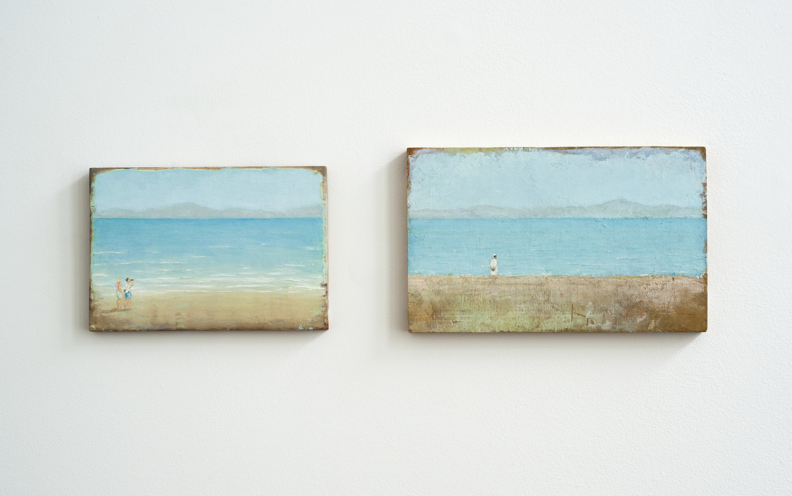

Please submit your Midterm proposal in this repository by making a pull request. 

1. Proposal should be 200 words or less
2. Proposal may include 1 image 

Proposal due date 2.25 Noon 

You will update your proposal with a full description and documentation before the Midterm presentation. 

Midterm due date 3.4 Noon 

Francis Alÿs, Untitled (Tangier - Tarifa, Oct 2007). Study for Don’t cross the bridge before you get to the river, 2007