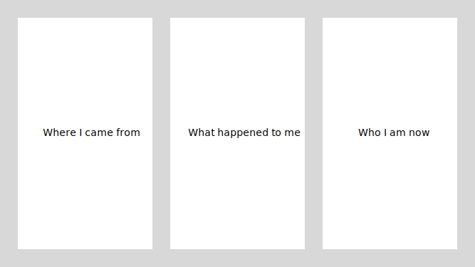

# Midterm Proposal, Andrew Lee

Based on the work of Joseph Beuys.

## Two Truths and a Lie: Personal Mythology

A comic writing workshop for children and adults.

### Setup

Crayons, pens, and pieces of paper are handed out to each participant.

Each piece of paper is divided into two sections:

- Where I came from...
- Who I am now...

Participants are told to illustrate or write in the two panels.

Content can be written word, imagery, or a combination of both. Panels can be subdivided if desired.

### The Mythology

The panels are capped with two bookend panels:

- the universe begins
- the universe ends

10 minutes before end of session, participants line up and place their piece somewhere in the timeline between the two endcaps.
