-Warp and Weft-

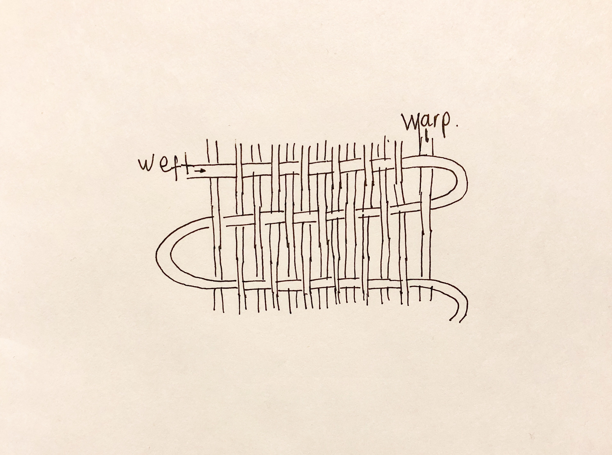 

My workshop is based on Anni Albers life and work. I want to explore her story, her credo and technique. In order to understand an get to know someone's work, is crucial to get familiar with their story, context and thoughts. Especially if that person ended up being a fundamental figure of the 20th century. 

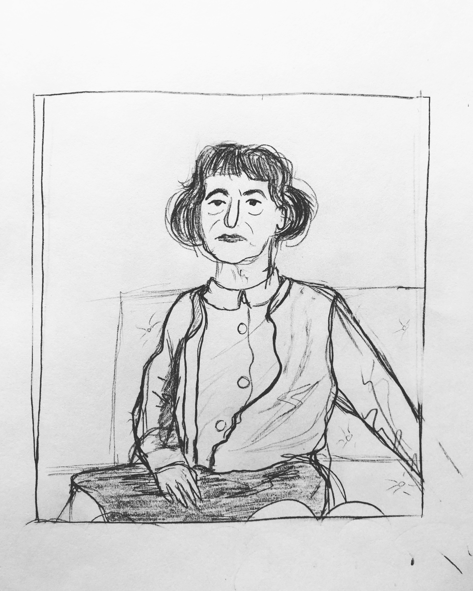 

This workshop aims to be a space of experimentation, play and material exploration. We will get to know Anni Albers life as a student and teacher at the Bauhaus, her visual world and approach to new material for weaving. Her practice helped made textile design a form of art.  

This workshop was to be ideally held at the MOMA. It was one of the first places where her work as a textile artist, her first solo exhibition at a museum. But I think the Jewish Museum would be a better place to present Anni Albers work, given that they approach her in 1979 to do a piece [Six prayers] for them to memorialize the victims of the holocaust.

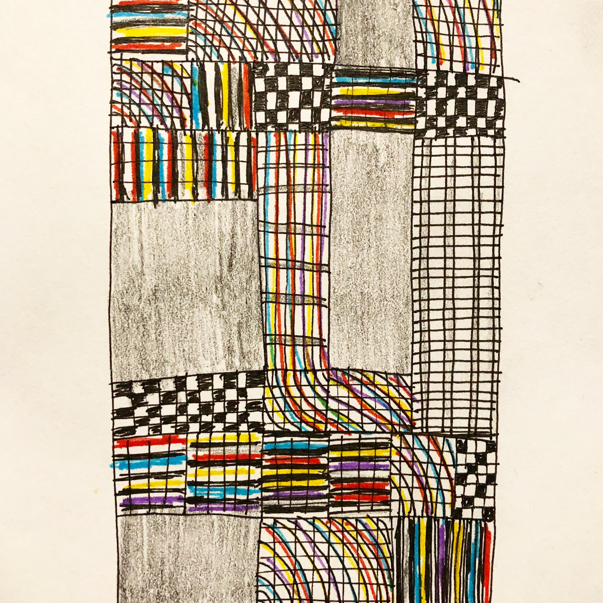

Workshop:

Materials: Pencils, colours,  paper

Capacity: 10 people (max) per session

Duration: One hour

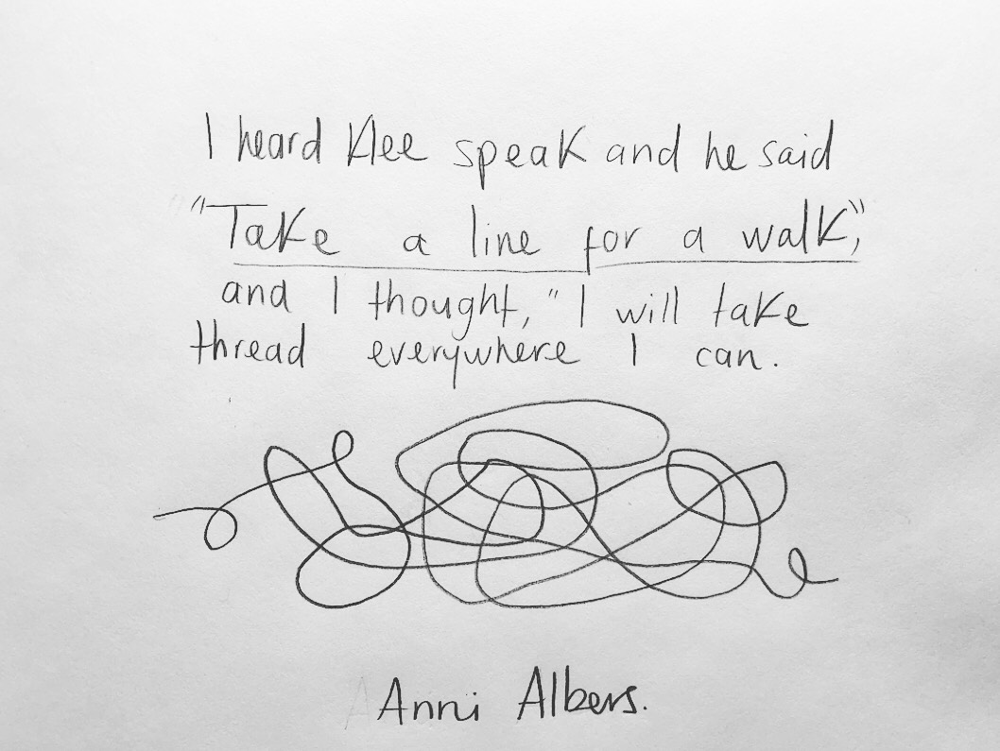

The idea behind this workshop is to get familiar with Anni Albers life and artwork. Through her life Anni was no stranger to experimentation, always looking for new materials and technique. As a textile artist, she created a path between craftsmanship and plastic art.  There will be a focus on Albers growth as an artist, highlighting notable changes in her artistic expression but a special focus on her late years, her approach to printmaking and colour.

• Introduction to Anni Albers early life and the Bauhaus / 10 Minutes
  Visual presentation - Bauhaus - Joseph - New forms and materials in textile designs

• Waves and knots -  group drawing / 5 Minutes

• America, Black Mountain and the MoMA / 10 Minutes
  Visual presentation - Life in the USA - New textiles - the First designer to have a solo exhibition in at the MoMA.

• Writing, Designing and Waving / 15 Minutes
  Visual presentation - New landscapes - New representations - New materials

• Prints and drawings / 25 Minutes
  Visual presentation - fragment from lecture series at the Museum of Modern Art  - New media - New machines - Six prayers
  
• “Draw an open letter with lines, dots and knots” activity  - individual 

• “Take a line for a walk” activity  - individual / group drawing 
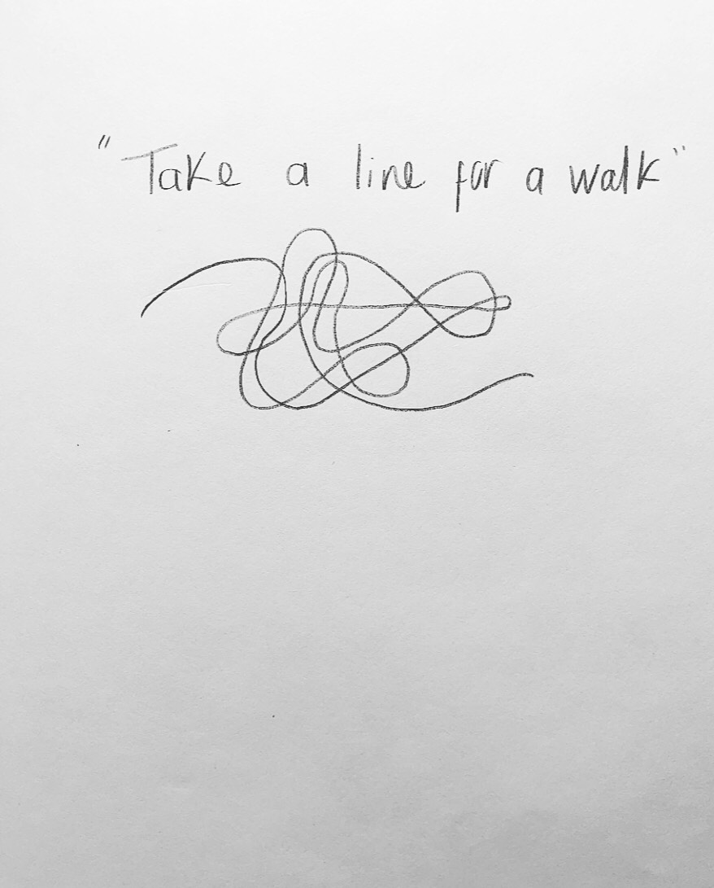

• Six Prayers. In situ

At the end of the workshop, all the pieces will be put out on display for visitors to see and zines will be made at the end of the workshop season. Participants will be encouraged once the session is over to explore the museum an look for our artist work on display. If they want they could share their findings and experience through the hashtag #warpnweft

 -----------------------------------------------------------------------------------------------------------------------------

• TAKE A LINE FOR A WALK -  10 minutes experience activity  - individual / group drawing - 7 Years & Up

Participants will have big sheets of paper and colors for this activity.

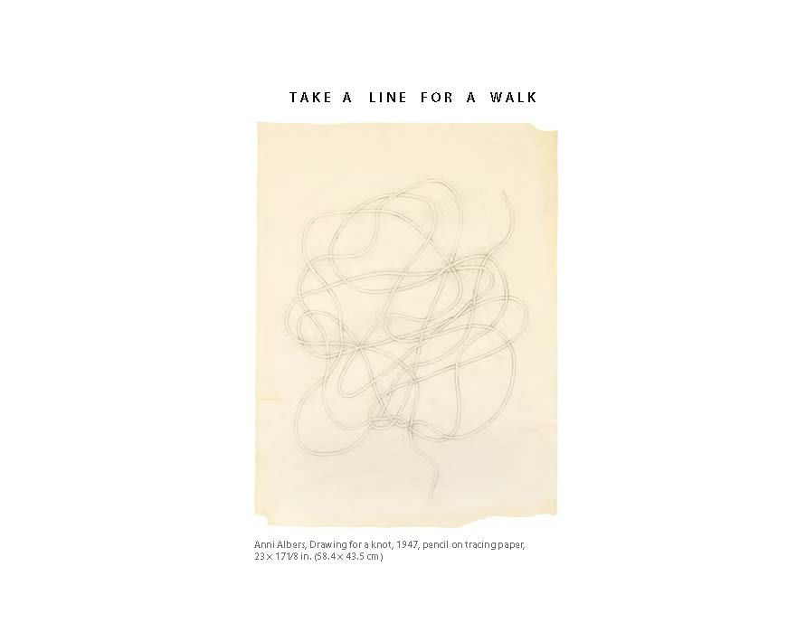
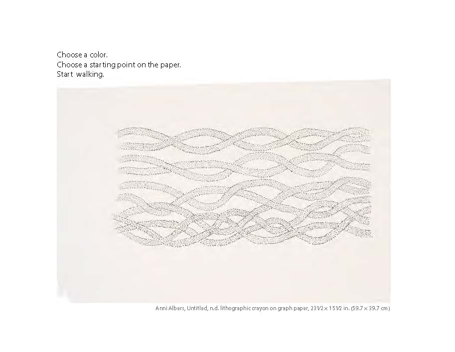
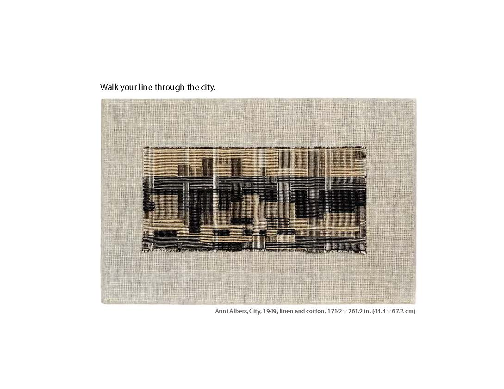
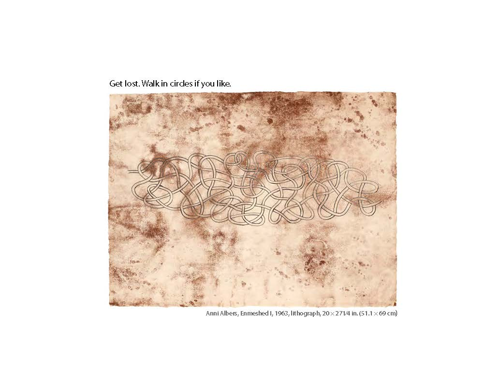
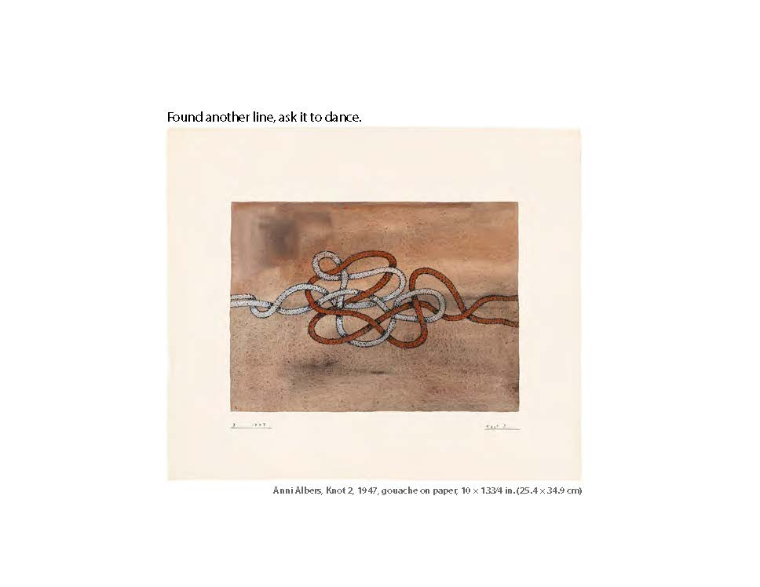

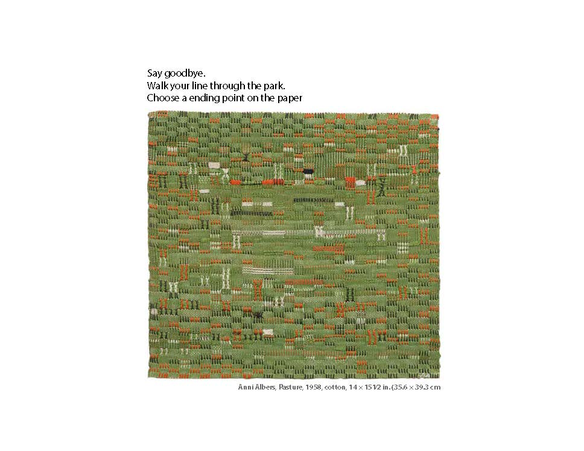
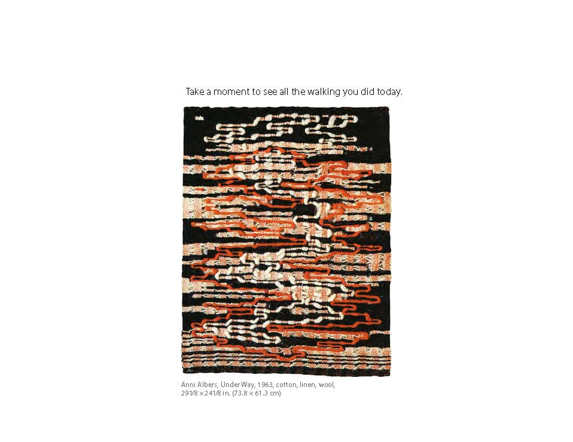

https://workbook.conditionaldesign.org
