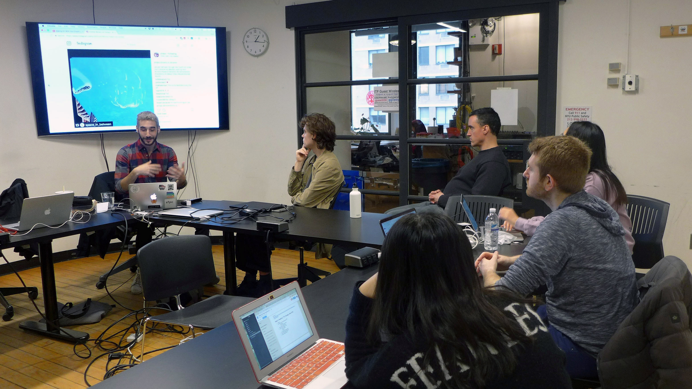
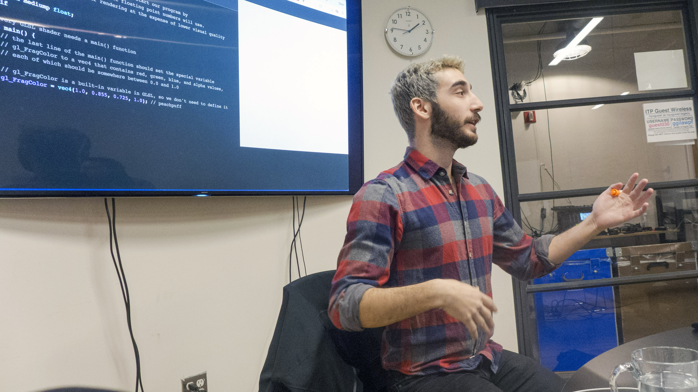

# Making Art With Your Graphics Card

My final workshop for Teaching as Art was an introduction to shaders and graphics programming. I attempted to explain how programming for the GPU differs from other types of programming, and to introduce participants to the GLSL programming language.

## Content

My syllabus for this workshop assumed no background or even interest in computer graphics on the part of my attendees: many people, including experienced computer programmers, do not know what shaders are. To create interest in the subject and to help illustrate what a shader is, I started with examples of shader-based projects that have inspired me: animations by the digital artists [Kynd](https://vimeo.com/kynd) and [Andrew Benson](https://pixlpa.com/), examples of code from the [Shadertoy](https://shadertoy.com/) online community, and an introduction to the work of [Patricio Gonzalez Vivo](http://patriciogonzalezvivo.com/), whose shaders inspire both my graphics and my educational work.

In particular, this workshop both borrows from and is inspired by Vivo's [The Book of Shaders](https://thebookofshaders.com). The code that I showed in this workshop was borrowed from his work, but heavily commented and condensed by me; I've found that book to be one of the best introductions to the technical details of shaders, and trying to come up with a better order for introducing aspects of GLSL felt like reinventing the wheel. If I were to expand this workshop into a weekend-long session, I'd be able to move beyond the material covered in the Book of Shaders. As it was, I only had time to cover the same basic topics.

After introducing the motivation for the workshop, I explained what a GPU is and how it differs from a CPU. I emphasized the differences between sequential and parallel computation, and we discussed the kinds of problems that each model was better suited to. To break up my lecture and reinforce what I'd just talked about, I showed a [YouTube video](https://www.youtube.com/watch?v=-P28LKWTzrI) of the Mythbusters using painting robots to demonstrate CPU vs. GPU.

Then we moved on to shaders. I defined the terms shaders, GLSL, OpenGL, and WebGL, and introduced [http://editor.thebookofshaders.com](http://editor.thebookofshaders.com), the browser-based editor that we'd be using for code examples. We started walking through some very minimal shaders, introducing the basic structure of a shader and gradually working in concepts like static typing, uniforms, normalized pixel coordinates, and built-in GLSL functions. This section took up most of the time, even though I felt like I was moving through the material pretty fast.

Once we got through the examples that I'd prepared, I gave the participants some small coding exercises to try, again borrowed from the Book of Shaders. When I do this workshop again, I'd like to spend less time lecturing and allocate more time for coding practice and one-on-one help sessions.

I wrapped up the workshop by suggesting some next steps for learning shaders, and shared some code examples that demonstrated how to use shaders in various creative coding environments.

## Timing

I went way over my allotted time; the workshop was supposed to be an hour, but it ended up taking closer to 2 hours to get through the material that I had planned. I think that, given the time constraints of the final assignment, I should have cut a lot of the code content from my syllabus. When I discussed my workshop with another ITP professor, they suggested that with only an hour, it might have been better not to have students open their laptops at all.

Alternatively, I think that this subject might be better suited to a 2-3 hour workshop or a weekend-long series, where there's time for the participants to take breaks and process what they've been taught. Learning to code involves building up muscle memory and internalizing a mental model of how programs work, both of which just take time.

## Feedback

Some notes of feedback that I received from participants:

- My teaching was clear, but it still took a long time to understand the idea that shaders run in parallel.
- I introduced a little too much material at once, and it was hard to absorb all of it.
- It was really helpful to go over how the GPU works before getting into the technical details of shaders.

## Slides

https://slides.com/oshoham/making-art-with-your-graphics-card
