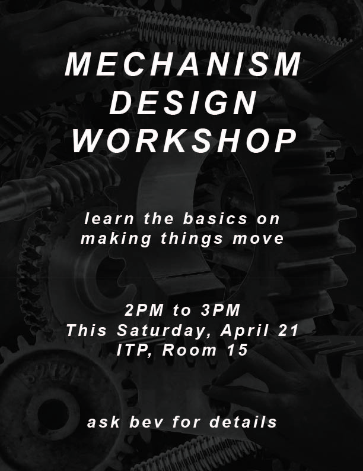

# Making Things Move
An Intro Mechanism Design Workshop

[See more thoughts on the workshop on my blog.](http://itp.beverlychou.com/making-things-move-final-workshop/)

## Workshop Goals

In this workshop, students will learn about basic examples of mechanical advantage and how to achieve certain kinds of motion. Students will do some hands on paper prototyping to design mechanisms of their own.

he goal is to give students a general idea of what types of components are available to you and how they can be used in simple projects. This will be a brief overview, but I will be happy answer more in-depth questions students have have after the workshop.

## Workshop Summary

Note: I'm not that strict on timing - the minute breakdown is a way for me to imagine the pacing of the class when designing the workshop. I will start about 5 minutes late to allow people to come in and get comfortable.

**Part 1: Intro and Lecture**

_2 min:_ Introduce myself and the workshop. Give an overview of the schedule.

_15 min:_  Give a brief presentation on gear mechanisms. A [PDF of slides are available here.](http://itp.beverlychou.com//assets/taa/gear-mechanism-slides.pdf) And then the [animated slides are available here.](https://docs.google.com/presentation/d/1lMmTcKCESPAyK5c3PL4g-5efqZzF-CwG5gpinp5aOLw/edit?usp=sharing)

1. Why are mechanisms important?
2. 6 types of movement --> 3 axes of translation and 3 axes of rotation
3. Anatomy of a gear - what is important for you to know when purchasing or making your own --> pitch, pressure angle, shaft size, # of teeth, diameter

**Part 2: Explaining Gears to Each Other**

_15 min:_ Hand out a series of cards with different mechanical components. If there are many students, form pairs. There is a drawing and explanation included on each card. Cards will be different colors for each component.

* Bevel gear
* Worm gear
* Helical gear + Spur gear
* Rack and pinion
* Cam and follower
* Lead Screw

Students will have time to review their card. During this time I will walk around and make sure students understand their component and are able to explain it. Next, students will explain their component to the rest of the class.

**Part 3: Hands-On Activity**

_15 min:_ Divide people into teams of 3-4 depending on class size. Teams will work together to make a mechanism based on specific goals (ex: convert rotational movement in this direction to translational movement in that direction). There will be extra cards with components for students to grab from if needed. There will also be simplified paper representations of the components to help students visualize the gears in space. I will walk around and help students.

_5 min:_ Teams will present their how their mechanisms works.

**Conclusion**

_8 min:_ Final thoughts to wrap up, thanks, and ask students to fill out a feedback form.

**Extra Time**

_8 min:_ If there's extra time, give a short presentation to explain the basic concepts around mechanical advantage and a simple 2 gear mechanism. Provide a few examples to solidify these ideas.
